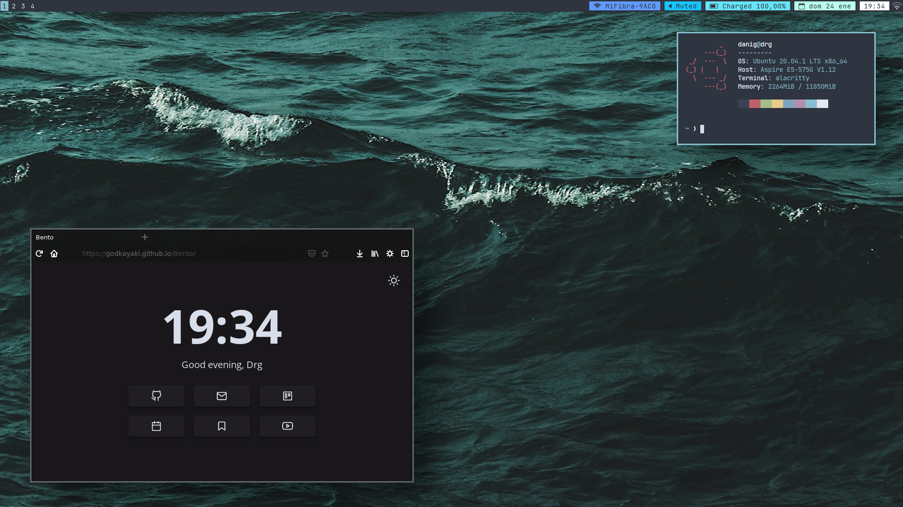

# dotfiles
There we go, my precious dotfiles.

### Links
- os: Ubuntu 20.04 (as for 24/01/2021)
- wm: [i3-gaps](https://github.com/Airblader/i3)
- dock: [i3status](https://github.com/i3/i3status)
- editor: [vscode with nord theme](https://marketplace.visualstudio.com/items?itemName=arcticicestudio.nord-visual-studio-code)
- terminal: [alacritty](https://www.jetbrains.com/es-es/lp/mono/)
- firefox config: [bento](https://github.com/MiguelRAvila/Bento)
- applauncher: [dmenu build](https://github.com/MiguelRAvila/CleanDmenu)

### Fonts
- [JetBrains Mono (font)](https://www.jetbrains.com/es-es/lp/mono/)
- [Dina (font)](https://www.dcmembers.com/jibsen/download/61/)
- [Gohufont (font)](https://github.com/koemaeda/gohufont-ttf)
- [Unifont (font)](https://fontlibrary.org/en/font/gnu-unifont)
- [scientifica (font)](https://github.com/NerdyPepper/scientifica)

### Contents
- i3, i3status and i3blocks configs. 
- alacritty, neofetch, dunst and compton configs. 
- spicetify config, colors and theme. 
- gtk icons and themes. 
- .bashrc aliases and launch. 
- Some personal bash scripts. 

### Show-off

