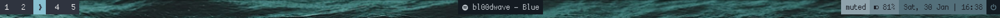
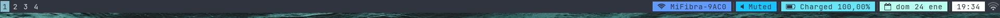

# dotfiles
Yet another nord rice with i3-gaps.

### Polybar or i3Status

### Links
- os: Ubuntu 20.04 (as for 24/01/2021)
- wm: [i3-gaps](https://github.com/Airblader/i3)
- dock: [polybar](https://github.com/polybar/polybar) / [i3status](https://github.com/i3/i3status)
- editor: [vscode with nord theme](https://marketplace.visualstudio.com/items?itemName=arcticicestudio.nord-visual-studio-code)
- terminal: [alacritty](https://www.jetbrains.com/es-es/lp/mono/)
- firefox config: [bento](https://github.com/MiguelRAvila/Bento)
- applauncher: [rofi nord theme](https://github.com/amayer5125/nord-rofi)

### Fonts
- [JetBrains Mono](https://www.jetbrains.com/es-es/lp/mono/)
- [Dina](https://www.dcmembers.com/jibsen/download/61/)
- [Gohufont](https://github.com/koemaeda/gohufont-ttf)
- [Unifont](https://fontlibrary.org/en/font/gnu-unifont)
- [scientifica](https://github.com/NerdyPepper/scientifica)
- [Fontawesome](https://fontawesome.com/)

### Contents
- i3 and i3status config (using polybar right now but i3status config files still work). 
- polybar config with spotify modules for i3.
- alacritty, neofetch, dunst, cava, rofi and compton configs. 
- spicetify config, colors and theme. 
- gtk icons and themes. 
- .bashrc aliases and launch. 
- Some personal bash scripts. 

### Show-off

